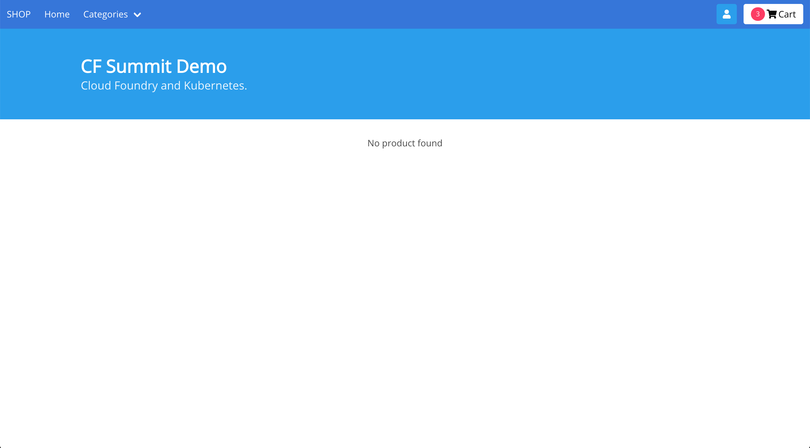
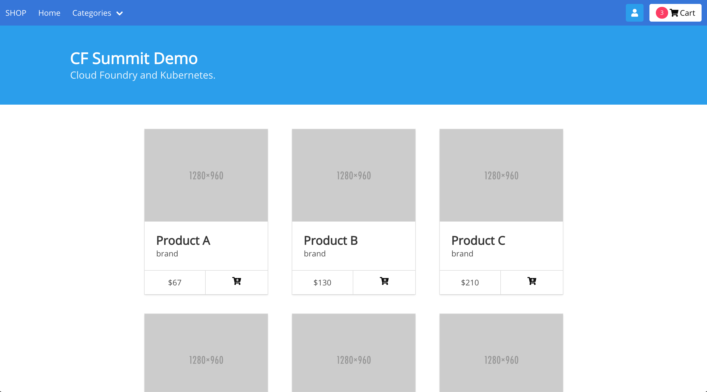

# CFEE Eirini Storefront frontend
A frontend shopping cart site using Node.js - the app is talking to the backend to fetch the shopping cart products. If the connection with the backend Cobol app is not set then no products will be displayed. 

# Deploy the app to CFEE

1. Log in to IBM Cloud and target your CFEE instance.

   ```bash
   ibmcloud login
   ibmcloud target --cf
   ```


1. [Deploy a CFEE instance and create an org and space](https://cloud.ibm.com/docs/tutorials?topic=solution-tutorials-isolated-cloud-foundry-enterprise-apps) in CFEE, have your CFEE environment ready to deploy apps. **SKIP** this step if you already have a CFEE instance and ready to deploys apps.

1. From your terminal, clone the [app](https://github.com/IBM-Cloud/eirini-demo) if you haven't already.

   ```bash
   git clone https://github.com/IBM-Cloud/eirini-demo
   ```

1. cd into the `frontend` app.

   ```bash
   cd frontend
   ```

1. Push the **frontend** app to CFEE.

   ```bash
   cf push
   ```

1. Open the running app in your browser. The shopping cart site is running but no products showing. 

# Connect the frontend to the backend

In this section, you will connect the frontend Cloud Foundry app to use the backend Kubernetes service. You must have deployed the [backend](https://github.com/IBM-Cloud/eirini-demo/tree/master/backend) before the steps below. 

1. Set the frontend env to use the backend service.

   ```bash
   cf set-env frontend BACKEND_URL http://backend-service.default.svc.cluster.local:8080
   ```

1. Restart the frontend app.

   ```bash
   cf restart frontend
   ```

1. Done, now open or refresh the frontend web application in the browser, you should see the products loading been fetched from the backend Kubernetes service. 

# Issues

If you have any question or doubt, please [create an issue](https://github.com/IBM-Cloud/eirini-demo/issues).


# License

Licensed under the [Apache License, Version 2.0](http://www.apache.org/licenses/LICENSE-2.0).